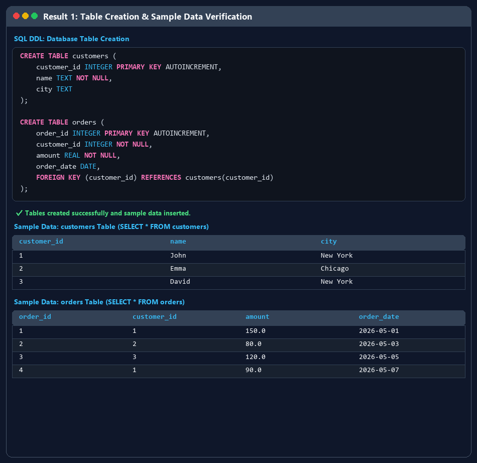
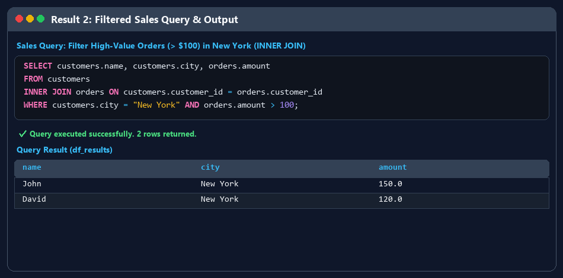
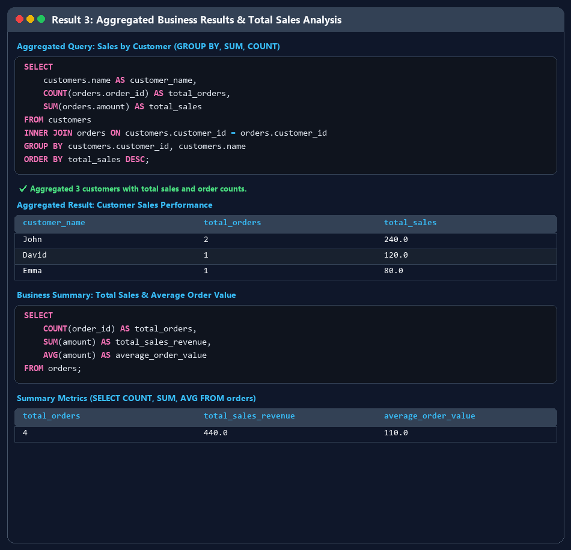

# Sales Data Analysis using SQL

## 📌 Project Overview
A beginner-friendly SQL project focused on creating a sales database, inserting data, and using SQL queries to analyze sales information.

## 🛠️ Skills Used
- SQL
- CREATE TABLE
- INSERT
- SELECT
- WHERE
- GROUP BY
- ORDER BY
- Aggregate Functions
- JOIN

## 📂 Project Structure
sales_data_sql_analysis.ipynb
README.md
images/

## 🔍 Key Analysis
- Sales by product
- Sales by customer
- Total sales
- Quantity analysis
- Group-wise sales analysis

## 📊 Results

### Result 1

### Result 2

### Result 3

## 🎯 Learning Outcome
This project helped me understand the fundamentals of SQL and how SQL can be used to analyze business data.

## 👨💻 Author
Surendra J
